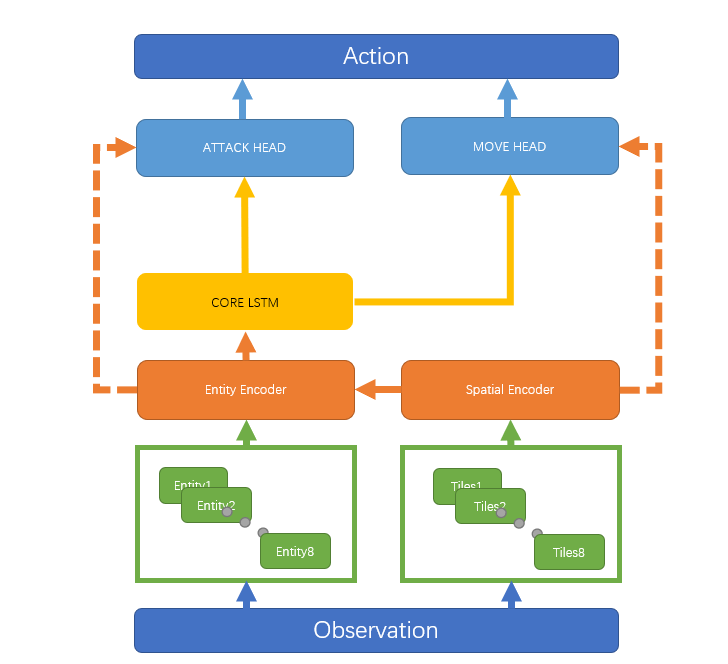

# Mini Alpha Neural MMORPG

## Introduction
This is a README file for our mini alpha Neural MMORPG program. In this project, codes are split into several parts. ```/ppo``` gives an example of distributed version of [PPO](https://arxiv.org/abs/1707.06347) algorithm. 

- ```/ppo/model``` is the structure of out policy network, which consists of a main body (```Arch.py```), Encoders, LSTM core and action heads.
- ```/ppo/rollouts``` is the data rollout.
- ```/ppo/scripts/config``` holds the config files.
- ```/ppo/utils``` holds some utils.
- ```/ppo/PPO_discrete_main.py``` is a discrete version of PPO, while ```/ppo/PPO_discrete_main_dist.py``` is a distributed version (implemented with ```torch.distributed.rpc```).
- ```/ppo/SupervisedLearning.py``` is the imitating training code.

### Our model
o implement a multi-agent policy, we design a hierarchical structure consisting of a series of deep
models. For the front end of the model, we aggregate observations of different agents and take the
advantage of resnet and transformer to encode the observations from both spatial and substantial
aspects. After that, the encoded data will be fed into an LSTM to be combined with the historical data.
And finally, action heads will decide according to all information mentioned above.



- Encoder Structure encodes the observations into embeddings. In Neural MMORPG, each tick of the team observation contains 1 to 8 agent observations, depending on the number of agents that are still alive. Each agent observation is made up of its surrounding terrains (denoted as Tile) and all entities including teammates, enemies, and NPCs in its sight (denoted as Entities). For each agent, their field of vision is limited, that is, they can only see grids with a Chebyshev distance less than or equal to 7. That leads to a map named Tile with 15 times 15 entries. Tile is a 2-dimensional map with each entry implying the terrain, describing properties of the map, saying, whether it is passable, what can be collected on the grid, and so on. We design a resnet with the number of input channels equal to its counterpart of map features to encode the spatial information. The model outputs a vector to represent the spatial status of each agent. After that, we shed light on the encoding process of entities. For each agent, it can see every entity in its field of vision. We first deduplicate the entities observed and then put all of them into a sequence after passing through an encoding layer. In addition, we exploit the previously learned spatial information to superimpose these vectors directly onto all our agent embeddings. To extract the information directly related to different entities, this sequence goes through a transformer encoder, and the output is entity embedding.


- Core Structure receives the previous hidden state and two embedded tensors (i.e.,
spatial embedding and entity embedding). The embedded tensors are concatenated into one tensor. The LSTM model will accept the tensor
and the previous hidden state, and output the new output and the new hidden
state.

- Head Structure calculates the probability of each action given observations. At each tick an agent can move up, down, left, right, or stay still; and can attack any entity with a Chebyshev distance less than or equal to 3. Thus we use two action heads to obtain the policy respectively. The attacking head accepts two tensors as input, i.e., the entity embedding and LSTM output. We concatenate the two tensors and put them into a feed-forward neural network. The output will be a vector with 3 entries for each entity, denoting 3 different ways to attack (i.e. melee, mage, and bow). The softmax of all outputs leads to the probability of each action. Note that not all entities are in the attack range, so all entities that are not attackable will be masked with a negative infinite number before softmax to avoid illegal action selection and gradient propagation.


### Training process

o The whole training process consists of two stages: supervised learning and reinforcement learning. In the supervised learning stage, we train the model using game replays of rule-based agents to obtain a base model that can imitate rule-based agents. Then the pre-trained model will be put into a self-play scenario, using the reinforcement learning method to continuously adjust the policy network.


## Quick Start

First git clone from [Neural MMO Starter Kit](https://gitlab.aicrowd.com/neural-mmo/neurips2022-nmmo-starter-kit)
```
git clone http://gitlab.aicrowd.com/neural-mmo/neurips2022-nmmo-starter-kit.git
conda create -n neurips2022-nmmo python==3.9
conda activate neurips2022-nmmo
cd ./neurips2022-nmmo-starter-kit
```

Then install git-lfs and download the environment wrapper prepared for NeurIPS 2022 Competition.
```
apt install git-lfs
pip install git+http://gitlab.aicrowd.com/neural-mmo/neurips2022-nmmo.git
pip install -r requirements_tool.txt
```

You can try to submit with
```
python tool.py submit "my-first-submission"
```

Run local evalution with
```
from neurips2022nmmo import CompetitionConfig, scripted, submission, RollOut

config = CompetitionConfig()

my_team = submission.get_team_from_submission(
    submission_path="my-submission/",
    team_id="MyTeam",
    env_config=config,
)
# Or initialize the team directly
# my_team = MyTeam("Myteam", config, ...)

teams = [scripted.CombatTeam(f"Combat-{i}", config) for i in range(5)]
teams.extend([scripted.MixtureTeam(f"Mixture-{i}", config) for i in range(10)])
teams.append(my_team)

ro = RollOut(config, teams, parallel=True, show_progress=True)
ro.run(n_episode=1)
```

Move this model to ```neurips2022-nmmo-starter-kit/my-submission``` and concat it to submission.py. Then run
```
python tool.py submit "alpha-neural-mmorpg"
```
